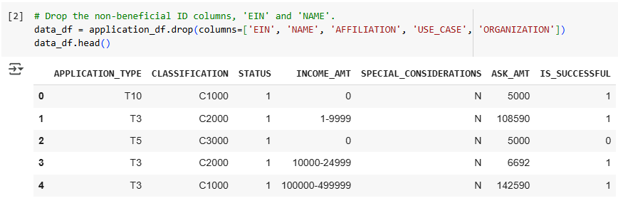
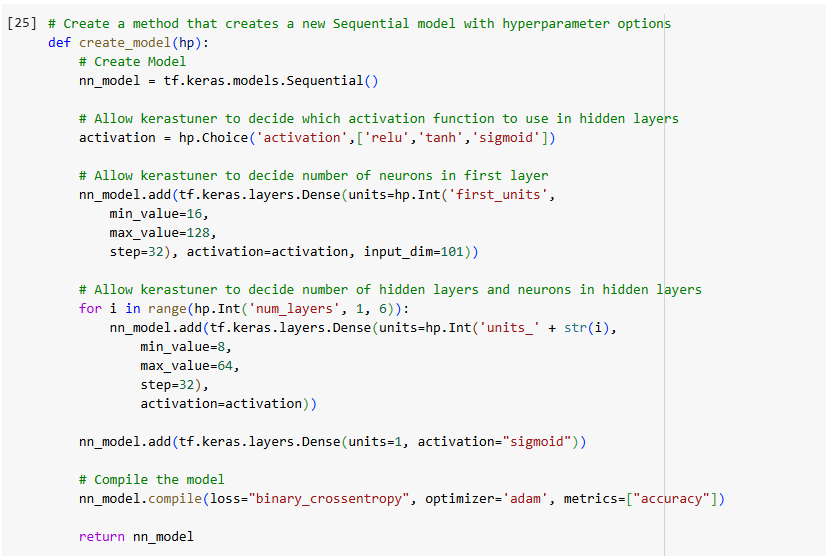
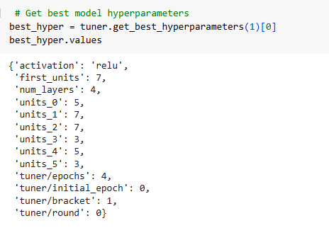
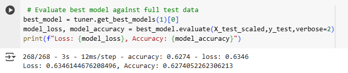

# Alphabet Soup Charity Model: Final Report

## Overview of the Analysis

The goal of this analysis was to design a binary classification model to predict whether an organization funded by Alphabet Soup would be successful in its venture. Using machine learning techniques, including data preprocessing and neural networks, we aimed to achieve a model with high predictive accuracy. The project followed three main steps: preprocessing the dataset, compiling and training the neural network model, and optimizing it to achieve the best performance possible.

## Results

### Data Preprocessing

- **Target Variable**: 
  - The target variable for the model is **IS_SUCCESSFUL**, which indicates whether the organization was successful in its venture.

- **Feature Variables**: 
  - The feature variables include a range of columns such as **APPLICATION_TYPE**, **CLASSIFICATION**, **STATUS**, **INCOME_AMT**, **ASK_AMT**, etc.

- **Variables to Remove**: 
  - The columns **EIN** and **NAME** were removed from the dataset as they were non-beneficial for the model’s prediction, being identifiers that do not influence the success of the organization.  To further try and refine the accuracy of the model, **AFFILIATION**, **USE_CASE**, and **ORGANIZATION** were removed as well.

    

### Compiling, Training, and Evaluating the Model

- **Neurons, Layers, and Activation Functions**: 
  - The final neural network model has the following architecture:
    - **Activation function**: **ReLU** (selected for hidden layers based on the best model's performance).
    - **Input layer**: 7 units (determined by the best hyperparameters).
    - **Hidden layers**: The model consists of **4 hidden layers** with the following unit distribution: **5, 7, 7, 3**.
    - **Output layer**: A single unit with a sigmoid activation function to predict success.

    

     

- **Achieved Model Performance**:
  - The final model achieved an **accuracy of 62.74%**, which is below the target of 75%. However, the model was able to make reasonable predictions given the data and achieved better performance than baseline methods.
  - The **loss** of the model was **0.6346**, which reflects the error in predictions, with lower values suggesting better model performance.

   

### Steps Taken to Increase Model Performance:

- **Hyperparameter Tuning**: 
  - The **activation function** was selected as **ReLU**, instead of **Tanh** used in earlier attempts. This activation function performed better based on the hyperparameter search results.
  - The model had **4 hidden layers** instead of the previously planned 2 layers, which provided a more complex architecture to handle the data.
  - We also adjusted the number of neurons in the hidden layers to **5, 7, 7, 3**. These configurations were selected to optimize the performance and increase the model's ability to generalize better on unseen data.

- **Model Optimization**:
  - The optimization focused on hyperparameter tuning, including adjustments to the number of neurons, layers, and activation functions using Keras Tuner.
  - Despite achieving a higher accuracy than baseline, further steps are needed to reach the target performance of over 75%. These steps could involve further tweaking the model architecture or using ensemble methods.
